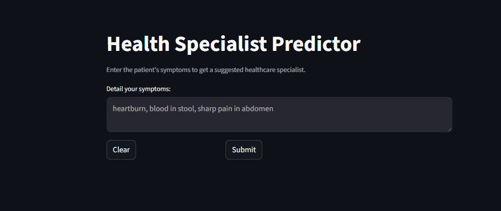

# 🧾 Health Specialist Predictor

An intelligent web-based application that leverages Natural Language Processing (NLP) to assist in predicting medical specialties based on patient-reported symptoms and descriptions. Built using Python, Streamlit, and powerful NLP techniques, this tool aims to support early triage and specialist recommendation.

---

## 📚 Table of Content
- <a href="#overview">Overview</a>
- <a href="#Features">Features</a>
- <a href="#tools--technologies">Tools & Technologies</a>
- <a href="#project-structure">Project Structure</a>
- <a href="#how-to-run-this-project">How to Run This Project</a>
- <a href="#Future-Enhancements">Future Enhancement</a>
- <a href="#Demo-Screenshots">Demo Screenshots</a>
- <a href="#Use-Cases">Use Cases</a>
- <a href="#author--contact">Author & Contact</a>

---

<h2><a class="anchor" id="overview"></a>Overview</h2>

This project is a smart, NLP-powered diagnostic assistant designed to interpret patient-reported symptoms and suggest relevant medical specialties. Built with Python and Streamlit, it transforms unstructured medical text into actionable insights using topic modeling and classification techniques. The goal is to support early triage, reduce diagnostic delays, and make healthcare more accessible—especially in resource-constrained settings.

---

<h2><a class="anchor" id="Features"></a>Features</h2>

- 🔍 Text preprocessing and cleaning (tokenization, stopword removal, lemmatization)
- 🧠 Topic modeling using CorEx / LDA / Gensim
- 🩺 Specialist prediction based on medical text input
- 📊 Interactive Streamlit interface for real-time diagnosis
- 🧾 Option to upload patient notes or enter symptoms manually
- 🌐 Deployable as a web app for clinics or individual use

---

<h2><a class="anchor" id="tools--technologies"></a>Tools & Technologies</h2>

- **Python** (Pandas, NumPy, scikit-learn, Gensim, CorEx, spaCy)
- **NLP** (Text preprocessing, Topic Modeling, TF-IDF, CountVectorizer)
- **Machine Learning** (Logistic Regression, Random Forest, XGBoost)
- **Streamlit** (Interactive Web Interface, Form Inputs, Real-time Predictions)
- **Model Persistence** (Pickle, Joblib)
- **Version Control** (Git, GitHub)
- **Deployment** (Streamlit Sharing, GitHub Pages, Docker - optional)

---

<h2><a class="anchor" id="project-structure"></a>Project Structure</h2>

```
medical-diagnosis-nlp/
│
├── README.md
├── .gitignore
├── requirements.txt
├── Medical Diagnosis Report.pdf
│
├── notebooks/                  # Jupyter notebooks for exploration and modeling
│   ├── topic_modeling_exploration.ipynb
│   ├── specialist_prediction_pipeline.ipynb
│
├── scripts/                    # Python scripts for training and utilities
│   ├── train_model.py
│   ├── preprocess_text.py
│   └── predict_specialist.py
│
├── app/                        # Streamlit app components
│   ├── app.py
│   ├── sidebar_config.py
│   └── ui_helpers.py
│
├── models/                     # Saved models and vectorizers
│   ├── vectorizer.pkl
│   ├── topic_model.pkl
│   └── classifier.pkl
│
├── data/                       # Sample input data and test cases
│   ├── sample_notes.csv
│   └── cleaned_data.csv
│
├── screenshots/                # Demo screenshots for README
│   ├── home_interface.png
│   ├── topic_modeling_output.png
│   └── specialist_prediction.png
```

---

<h2><a class="anchor" id="how-to-run-this-project"></a>How to Run This Project</h2>

1. Clone the repository:
```bash
git clone https://github.com/yourusername/medical-diagnosis-nlp.git
cd medical-diagnosis-nlp
```
2. Install required dependencies:
```bash
pip install -r requirements.txt
```
3. Launch the Streamlit app:
```bash
streamlit run app.py
```
---

<h2><a class="anchor" id="Future-Enhancements"></a>Future Enhancement</h2>

- Multilingual support for regional languages
- Integration with EHR systems
- Confidence scores and explainability
- Mobile-friendly UI

---

<h2><a class="anchor" id="Demo-Screenshots"></a>Demo Screenshots</h2>

Here’s a glimpse in action:


<br>
<em>This screenshot shows the main interface where users can input symptoms or upload medical notes, and receive predicted medical specialties in real time.</em>
---

<h2><a class="anchor" id="Use-Cases"></a>Use Cases</h2>

- Primary care clinics for triage support
- Telemedicine platforms
- Medical education tools
- Research on symptom-specialist mapping

---

<h2><a class="anchor" id="author--contact"></a>Author & Contact</h2>

* DEEKSHANT RAHANGDALE *

📧 Email: deekshantrahangdale07@gmail.com
🔗 [LinkedIn](https://www.linkedin.com/in/deekshant-rahangdale-563015256/)  

